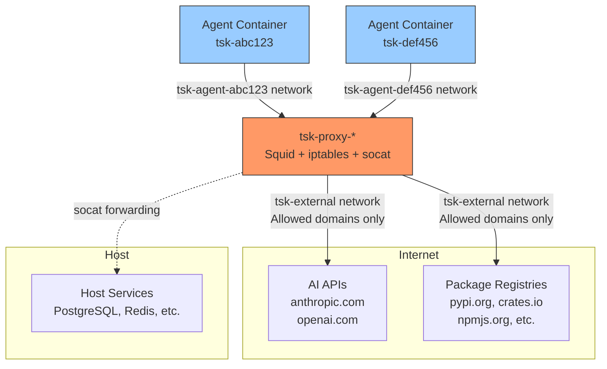
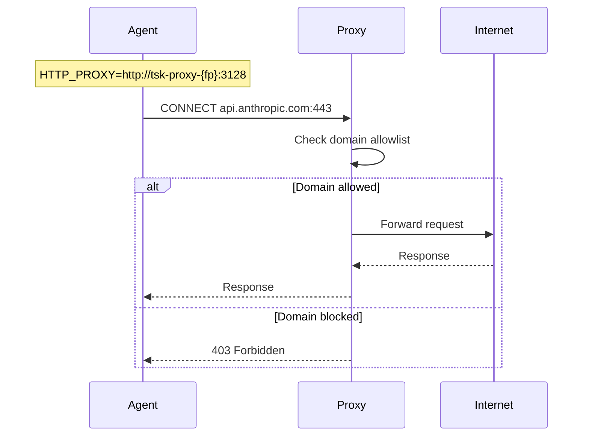

# Network Isolation in TSK

TSK uses a multi-layered network isolation strategy to ensure AI agents can only access approved external services. This document explains how the network architecture works and the security properties it provides.

## Architecture Overview



## Key Components

### Per-Agent Isolated Networks

Each agent container runs in its own Docker network created with the `internal: true` flag. Internal networks have no external gateway, meaning containers on them physically cannot route to the internet.

- **Network naming**: `tsk-agent-{task-id}`
- **Lifecycle**: Created when task starts, destroyed when task completes
- **Isolation**: Each agent is on a separate network, agents cannot communicate with each other

### Proxy Container (tsk-proxy-{fingerprint})

The proxy container is the sole gateway between agent networks and the outside world. Each unique proxy configuration (host_ports + squid.conf) gets its own proxy container identified by a fingerprint. A proxy connects to:
1. The `tsk-external-{fingerprint}` network (has internet access)
2. Each active agent's isolated network (joined on-demand)

The proxy runs:
- **Squid**: HTTP/HTTPS proxy with domain allowlist
- **socat**: TCP port forwarder for host service access
- **iptables**: Firewall rules for defense-in-depth

### Connection Flow



## Security Layers

TSK implements defense-in-depth with multiple independent security boundaries:

| Layer           | Mechanism                  | What It Prevents                     |
|-----------------|----------------------------|--------------------------------------|
| **Network**     | Docker internal networks   | Direct external connections          |
| **Firewall**    | iptables in proxy          | Non-proxy traffic to proxy container |
| **Application** | Squid domain allowlist     | Access to non-approved domains       |
| **Capability**  | Dropped NET_RAW, NET_ADMIN | Raw sockets, firewall changes        |
| **DNS**         | No direct resolver access  | DNS-based exfiltration               |

### Domain Allowlist

The Squid proxy allows access to:

- **AI APIs**: api.anthropic.com, api.openai.com, sentry.io, statsig.com
- **Python**: pypi.org, files.pythonhosted.org
- **Rust**: crates.io, index.crates.io, static.crates.io
- **Go**: proxy.golang.org, sum.golang.org, pkg.go.dev
- **Java**: repo.maven.apache.org, plugins.gradle.org
- **Node.js**: registry.npmjs.org, nodejs.org

Custom proxy configuration can be placed at `~/.config/tsk/squid.conf`.

### Host Service Access

The proxy can forward TCP connections to services running on the host machine. Configure in `tsk.toml`:

```toml
[defaults]
host_ports = [5432, 6379, 3000]  # PostgreSQL, Redis, dev server
```

Agents connect to `$TSK_PROXY_HOST:<port>` and traffic is forwarded to `host.docker.internal:<port>`.

### Agent Container Hardening

Agent containers run with dropped capabilities:

- `NET_ADMIN` - Cannot modify network configuration
- `NET_RAW` - Cannot create raw sockets (blocks ping, packet sniffing)
- `SYS_ADMIN` - Cannot mount filesystems or perform namespace operations
- `SYS_PTRACE` - Cannot trace other processes

## Why Internal Networks Over iptables?

TSK uses Docker internal networks rather than iptables rules in agent containers because:

1. **Secure by construction**: No route to external networks exists, rather than relying on firewall rules to block it
2. **No capability grants needed**: Agents don't need `CAP_NET_ADMIN` to set up firewall rules
3. **Bypass-resistant**: Even root in the container cannot create a route that doesn't exist
4. **DNS isolation for free**: No direct resolver access is possible
5. **Simpler failure mode**: If something goes wrong, agents have no connectivity rather than full connectivity
6. **Independent of image contents**: Custom project Dockerfiles cannot weaken isolation since it's a property of the network topology, not container configuration

## Disabling Network Isolation

Network isolation can be disabled on a per-task basis using the `--no-network-isolation` flag. When disabled, the container runs on the default Docker network with direct internet access, bypassing the proxy and isolated network setup entirely.

```bash
# Run a task without network isolation
tsk run --no-network-isolation -p "Install dependencies requiring custom registry"

# Add a queued task without network isolation
tsk add --no-network-isolation -p "Task needing unrestricted network access"

# Launch an interactive shell without network isolation
tsk shell --no-network-isolation
```

When network isolation is disabled:
- No proxy container is started or used
- No isolated Docker network is created
- The container has direct internet access (default Docker networking)
- `HTTP_PROXY` / `HTTPS_PROXY` environment variables are not set
- The `NET_RAW` capability is not dropped (tools like `ping` will work)
- All other security hardening (dropped capabilities like `NET_ADMIN`, `SYS_ADMIN`, etc.) remains in effect

Use this flag when tasks require network access patterns that are incompatible with the proxy-based filtering, such as custom package registries, proprietary APIs not on the allowlist, or debugging network connectivity issues.

## Verifying Isolation

Run the network isolation test script:

```bash
./scripts/network-isolation-test.sh
```

This tests:
- Allowed domain access (should succeed)
- Non-allowed domain access (should fail)
- Direct connections bypassing proxy (should fail)
- Raw socket operations like ping (should fail)
- Cloud metadata endpoints (should fail)
- Local network access (should fail)
